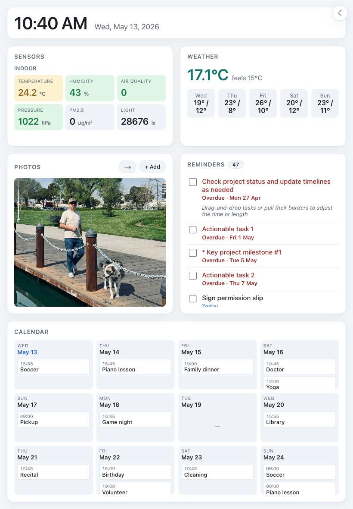

# homedash

A single-binary home dashboard built to live on an iPad Air in the kitchen.
Renders the time, weather, indoor sensors, family calendar, reminders, and a
photo slideshow on one page that stays current via server-sent events.



## What's on the dashboard

- **Clock** — local time + date, ticks every second client-side.
- **Sensors** — color-coded tiles for temperature, humidity, AQI, pressure,
  PM2.5, light. Values come from MQTT (one JSON message can fan out into many
  tiles via a `field` selector).
- **Weather** — current + 5-day forecast for a configured lat/lon
  (Open-Meteo, no API key).
- **Calendar** — 4×3 day cells for the next ~12 days. Pulls from Google
  Calendar and/or iCloud CalDAV; events from both merge automatically.
- **Reminders** — scrollable list with due dates, notes, a per-item
  countdown after you tick a box. Sources: Google Tasks, Todoist, and
  iCloud CalDAV-VTODO can all run side-by-side; the iPad's tick routes
  back to the source that owns each item.
- **Photos** — slideshow from a Google Photos picker session, or from
  uploads via the `+ Add` button, or from a local folder.

## How it talks to the world

| Source              | Protocol                      | Auth                     |
|---------------------|-------------------------------|--------------------------|
| Indoor sensors      | MQTT subscribe                | broker user/pass         |
| Weather             | Open-Meteo HTTPS              | none                     |
| Google Calendar / Tasks / Photos Picker | REST + OAuth | one-time `auth-google`   |
| Todoist             | REST v2                       | API token                |
| iCloud Calendar / Reminders | CalDAV (PROPFIND/REPORT) | Apple ID app-password |

Everything updates over an SSE channel: each source has its own poll
goroutine; when state changes the server emits a section event and every
open tab refetches just that fragment. No polling from the browser.

## Setup

### Build

```sh
make build            # generates templates, builds ./dist/homedash
make build-pi         # cross-compiles ./dist/homedash-arm64 for the Pi
```

### Config

Two files. Copy the examples in [deploy/](deploy/) and edit:

- **config.yaml** — non-secret settings: lat/lon, MQTT topics, calendar
  names, polling intervals.
- **secrets.env** — API keys and passwords (`secrets.env` is gitignored).
  Loaded via `set -a; . ./secrets.env; set +a` before running.

Minimum to run: a config file + ICloud creds (or comment out the iCloud
loader if you don't use Apple at all — see [config.go](internal/config/config.go)).

### One-time auths

```sh
set -a; . ./secrets.env; set +a

# Google: opens a browser, captures the OAuth callback on loopback,
# saves ./var/google_token.json. Refresh tokens persist; the dashboard
# auto-refreshes silently from then on.
./dist/homedash auth-google -config ./config.yaml

# Google Photos: pick the photos you want in the slideshow once. The
# files download into photos.cache_dir and the dashboard plays from
# disk afterwards.
./dist/homedash pick-photos -config ./config.yaml
```

### Run

```sh
set -a; . ./secrets.env; set +a
./dist/homedash -config ./config.yaml
# → homedash listening on :8080
# →   http://localhost:8080
# →   http://192.168.1.110:8080
```

Point the iPad's Safari at the LAN URL, "Add to Home Screen", set
"Guided Access" if you want kiosk behavior. The dashboard fits an iPad
Air portrait viewport (~820×1180) and uses no-cache headers on static
assets so a redeploy doesn't leave the iPad on stale CSS.

### Deploy to a Raspberry Pi

```sh
make build-pi
make deploy   # rsyncs binary, systemd unit, example config to /tmp; installs
```

See [deploy/homedash.service](deploy/homedash.service). The `doctor`
make target prints the rest of the on-Pi setup (user, /var/lib paths,
secrets.env mode 0600).

## Architecture

```
cmd/homedash/main.go    glue: load config, start pollers, mount HTTP/SSE
internal/
  config/               yaml + env load
  state/                snapshot store, source-bucketed merge, SSE notify
  caldav/               iCloud calendar + reminders (with workarounds for
                        iCloud's REPORT response quirks)
  gcal/                 Google Calendar via google.golang.org/api
  gtasks/               Google Tasks; iPad toggle hits Tasks.Patch
  gpicker/              Google Photos Picker session flow + downloads
  todoist/              Todoist REST v2 client + dispatcher entry
  google/               shared OAuth (token cache + savingTokenSource)
  mqttsub/              Paho MQTT subscriber, JSON-field fan-out
  weather/              Open-Meteo poller
  rss/                  (legacy; not rendered, kept for revival)
  photos/               local-folder slideshow poller (fallback / uploads)
  store/                sqlite for photo + news dedupe
  web/                  chi router, htmx + SSE, /fragment/* handlers
    templates/          templ files (regenerate with `templ generate`)
    static/             CSS, htmx, slideshow.js, theme.js, reminders.js
```

Multiple sources contribute to one merged event list (`SetEventsFromSource`)
or reminders list (`SetRemindersFromSource`). The toggle handler routes
to the right backend by looking at `Reminder.Source`.

## License

MIT. See [LICENSE](LICENSE).
